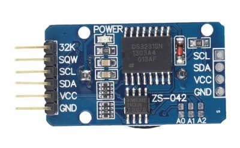

# DS3231

DS3231 real-time clock (RTC)  is a low power, full binary-coded decimal (BCD) clock/calendar, with alarm output.



## I2C Address

0x68

## API

* **Year(year = None)**  
get / set year.  

* **Month(month = None)**  
get / set month.  

* **Day(day = None)**  
get / set day.  

* **Weekday(weekday = None)**  
get / set month.  

* **Hour(hour = None)**  
get / set hour.  

* **Minute(minute = None)**  
get / set minute.  

* **Second(second = None)**  
get / set second.  

* **DateTime(dat = None)**  
get / set DateTime. If no paramter given, it will return current datetime, otherwise it will set datatime.  
datatime format: [Year, month, day, weekday, hour, minute, second]

* **Temperature()**  
get ambient temperature.  

* **ClearALARM()**  
Clear alarm flag. It must be call to clear SQW output manual.  

* **ALARM(day, hour, minute, repeat)**  
set ALARM time and repeat.  
repeat: ALARM repeat mode
  - PER_MINUTE, alarm every minute, when second become zero.
  - PER_HOUR,   alarm every hour, when minute equal with RTC's minute.  
  - PER_DAY,    alarm ervry day, when hour and minute equal with RTC's hour and minute.
  - PER_WEEKDAY, alarm every week, when day equal with RTC's weekday.
  - PER_MONTH,  alarm every month, when day and hour and minute equal with RTC.
  - DISABLE, disable alarm.  

## example

```
from microbit import *
import DS3231

ds = DS3231.DS3231()

ds.Hour(12)

ds.Time()
ds.Time([12,10,0])

ds.DateTime([2018,3,12,1,22,10,0])

ds.ALARM(12, 20, 10, ds.PER_DISABLE)
ds.ALARM(12, 20, 10, ds.PER_DAY)
ds.ClearALARM()
```

From microbit/micropython Chinese community.  
www.micropython.org.cn
